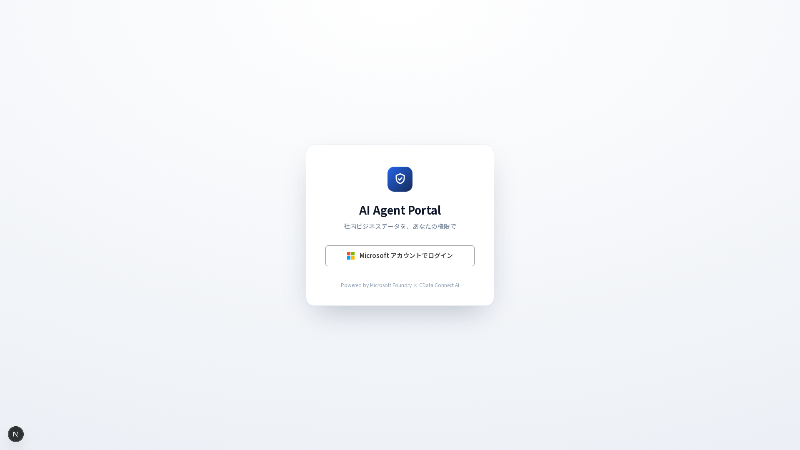
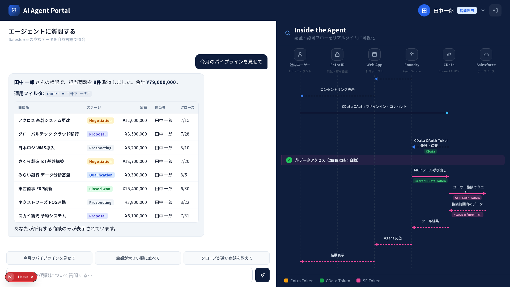
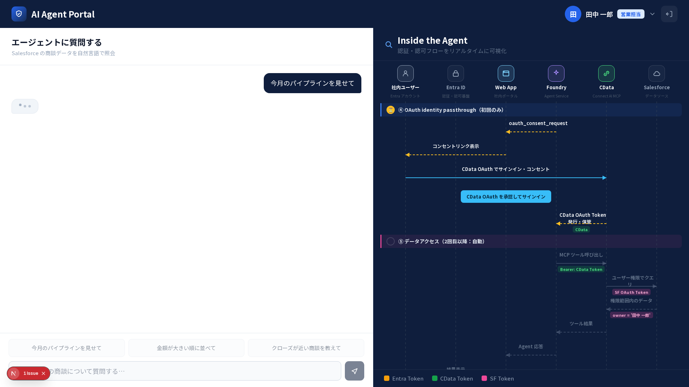

# AI Agent Portal（ライブデモ）

「**AI エージェントはログインユーザーの権限（RBAC）の範囲でしかデータを返せない**」ことを、画面を見るだけで直感的に理解させるライブデモ用の 1 画面アプリです。AI Dev Day 2026 セッション「エンタープライズデータへ安全につなぐ Production-ready なエージェント設計」で使用します。

- ログイン（Microsoft 風）→ チャットで質問 → 回答が Markdown（表付き）でストリーミング表示
- 右パネル「Inside the Agent」が認証・認可フロー（①〜⑤）をシーケンス図でリアルタイム可視化
- 初回のみ ④ CData OAuth で**コンセント待ち**になり、承認ボタンで再開（デモの山場）
- ヘッダーでユーザー切替（田中＝営業担当／山田＝マネージャー）→ 同じ質問で**取得件数とフィルタが変化**

詳細な仕様は [docs/](docs/) を参照してください（[product-requirements](docs/product-requirements.md) / [functional-design](docs/functional-design.md) / [architecture](docs/architecture.md)）。

## 画面イメージ

| ログイン                                  | 応答後（田中・8件）                                    | コンセント待ち                                        |
| ----------------------------------------- | ------------------------------------------------------ | ----------------------------------------------------- |
|  |  |  |

## デモ動画

<video src="https://github.com/user-attachments/assets/c9d7f9ca-e3dc-49a7-a73a-484aea215992" controls width="100%"></video>

## 技術スタック

- Next.js 15（App Router） / React 19 / TypeScript strict
- Tailwind CSS v3 ＋インラインスタイル（デザイントークン）
- react-markdown（＋remark-gfm / rehype-raw / rehype-sanitize）
- テスト：Vitest + React Testing Library（単体・コンポーネント）／ Playwright（E2E）

## セットアップ

DevContainer（Node 20）での利用を前提としています。「Reopen in Container」で開くと `postCreateCommand` が `npm install` と Chromium の導入を行います。

手動で行う場合：

```bash
npm install
npx playwright install --with-deps chromium   # E2E を実行する場合
cp .env.local.example .env.local              # 必要に応じて編集
```

## 起動

```bash
npm run dev
# http://localhost:3000
```

> 現状（初回実装フェーズ）は **すべてモックデータ**で動作します（Salesforce/Entra/Foundry への実接続は後続フェーズで `src/hooks/useAgent.ts` 内に差し替え実装します）。

## デモ操作フロー

1. 「Microsoft アカウントでログイン」を押す
2. プリセット「今月のパイプラインを見せて」を押す（または自由入力）
3. ④ でコンセント待ちになったら「CData OAuth を承認してサインイン」を押す
4. 回答（田中：8件・¥79,000,000）が表示される
5. ヘッダー右のユーザー名をクリック →「山田 花子」に切替 → 同じプリセットを再送
6. 山田：16件（チーム全員）が表示され、④ で止まらず、⑤ フィルタ注記が「全担当」に変化

## 環境変数（デモ挙動の調整）

`.env.local`（テンプレートは [.env.local.example](.env.local.example)）。

| 変数                        | 既定    | 説明                                                                                                                                           |
| --------------------------- | ------- | ---------------------------------------------------------------------------------------------------------------------------------------------- |
| `NEXT_PUBLIC_STEP_DELAY_MS` | `9500`  | Inside the Agent の 1 ステップ表示時間（ms）。**開発・リハーサル=`1000`／本番=`9500`**（説明しながら進める想定）。範囲 1000–15000 でクランプ。 |
| `NEXT_PUBLIC_MOCK_MODE`     | `false` | 会場ネットワーク障害時のフォールバック。現状は常にモック動作のため実質未使用（後続フェーズで実接続の切替に使用）。                             |
| `AZURE_*` / `FOUNDRY_*`     | —       | 後続フェーズの実接続用（現状のモードでは未使用）。                                                                                             |

例：素早く確認したいとき

```bash
NEXT_PUBLIC_STEP_DELAY_MS=1000 npm run dev
```

## スクリプト

| コマンド                          | 内容                             |
| --------------------------------- | -------------------------------- |
| `npm run dev`                     | 開発サーバ（localhost:3000）     |
| `npm run build` / `npm start`     | 本番ビルド / 起動                |
| `npm run lint`                    | ESLint                           |
| `npm run typecheck`               | `tsc --noEmit`                   |
| `npm run format` / `format:check` | Prettier 整形 / チェック         |
| `npm run test` / `test:watch`     | Vitest（単体・コンポーネント）   |
| `npm run test:e2e`                | Playwright（E2E 受け入れテスト） |

E2E は `playwright.config.ts` の `webServer` が `MOCK_MODE=true` / `STEP_DELAY_MS=80` で dev サーバを自動起動します。

## ディレクトリ構成（抜粋）

```
src/
├── app/            # App Router（page.tsx に login/portal を集約）
├── components/     # UI（chat / agent(シーケンス図) / layout）
├── hooks/          # useAuth / useAgent / useAgentFlow
├── lib/            # mockData / sequence / tokens / types
└── styles/         # globals.css（.md-body・keyframes）
e2e/                # Playwright（acceptance / screens）
docs/               # 永続ドキュメント（仕様・設計）
.steering/          # 作業単位のステアリング（要求・設計・タスク）
```

詳細は [docs/repository-structure.md](docs/repository-structure.md) を参照。
