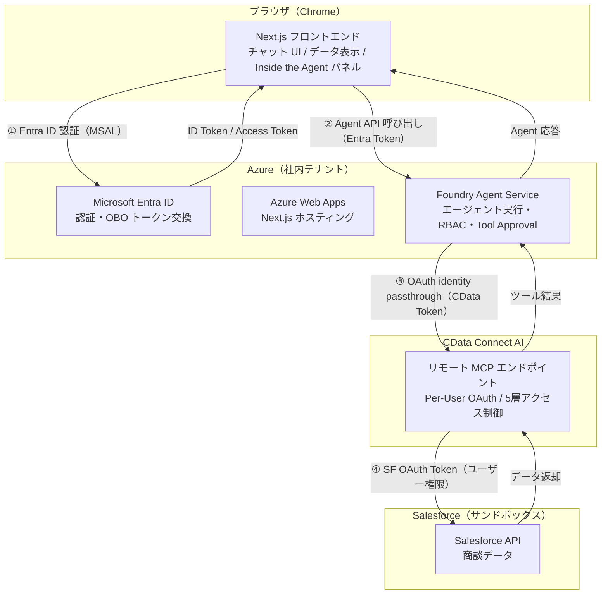
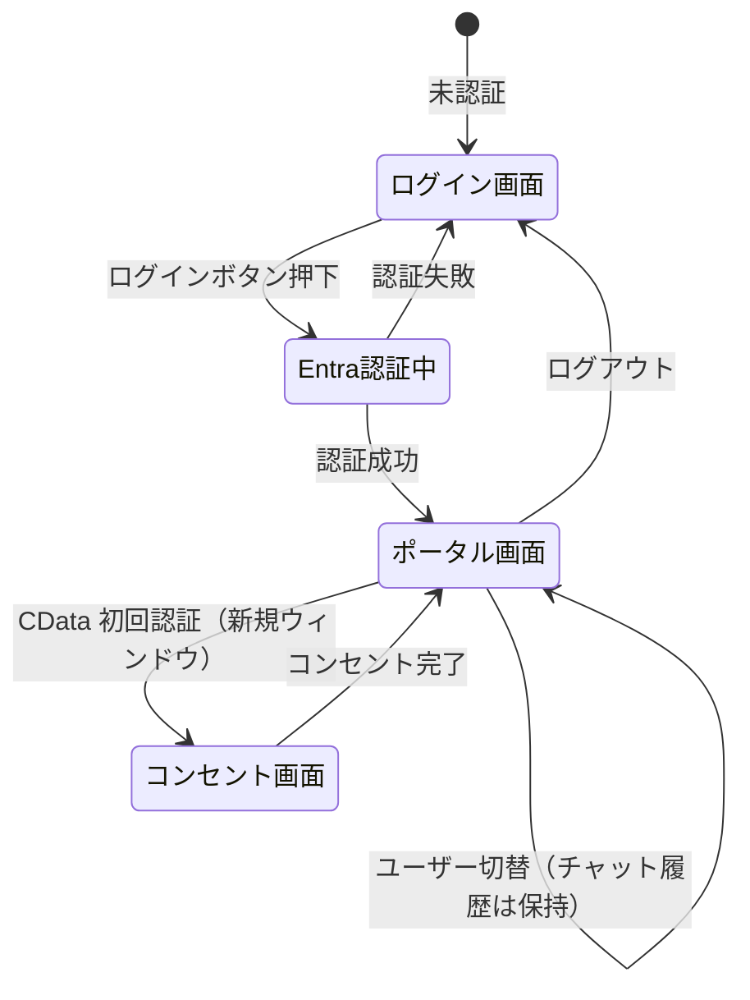

# 機能設計書

> バージョン：1.0　作成日：2026年7月1日　作成者：杉本 和也

---

## 1. システム構成図



---

## 2. 画面構成

### 2-1. 全体レイアウト

**2カラム構成**（デザイン確定）。Salesforceデータは独立パネルではなくチャット内のMarkdown応答として表示する。

```
┌──────────────────────────────────────────────────────────────────┐
│  HEADER（height:78px, background:#0F1E3D）                       │
│  [🤖 AI Agent Portal]          [👤 田中 一郎（営業担当）▼] [→]  │
├────────────────────────────┬─────────────────────────────────────┤
│                            │                                     │
│   CHAT PANEL（flex:1）     │   INSIDE THE AGENT（width:880px）   │
│                            │                                     │
│  ユーザーの質問             │  参加者ヘッダー（6者）              │
│  ↕                         │  ライフライン（縦点線）              │
│  エージェント応答           │  ① ユーザー認証    ✅              │
│  （Markdown形式）           │  ② OBO交換        ✅              │
│  ・件数・合計金額           │  ③ Foundry処理    ⚙️              │
│  ・商談テーブル             │  ④ CData OAuth    ⏳              │
│  ・フィルタ条件             │  ⑤ データアクセス  -               │
│                            │                                     │
│  [プリセットボタン×3]       │  [トークン凡例]                    │
│  [入力欄_____________] [→] │                                     │
└────────────────────────────┴─────────────────────────────────────┘
```

### 2-2. ヘッダー

| 要素 | 内容 |
|------|------|
| ロゴ | 「AI Agent Portal」テキスト + アイコン |
| ユーザー情報 | ログイン中のユーザー名・役職を表示 |
| ユーザー切替ボタン | デモ用アカウントを素早く切り替えるドロップダウン |
| ログアウトボタン | Entra ID セッションを破棄してログイン画面へ |

### 2-3. チャットパネル（左）

| 要素 | 内容 |
|------|------|
| メッセージ履歴 | ユーザー発言・エージェント応答を時系列で表示 |
| ストリーミング表示 | イントロ文（件数・合計金額）をタイプライター表示 → 商談テーブルを一括表示 |
| Salesforceデータ表示 | チャット応答内のMarkdownテーブルとして表示（独立パネルなし） |
| プリセットボタン | 3種を横並びで用意。ソートモードと連動 |
| 入力欄 | テキスト入力 + 送信ボタン |
| ローディング表示 | 思考中は3ドットアニメーション、ストリーミング中は末尾キャレット点滅 |

**プリセットプロンプトとソートモード**

| ボタン | ソートモード |
|--------|------------|
| 「今月のパイプラインを見せて」 | `pipeline`（デフォルト順） |
| 「金額が大きい順に並べて」 | `amount`（金額降順） |
| 「クローズが近い商談を教えて」 | `close`（クローズ日昇順） |

### 2-4. Inside the Agent パネル（右）

認証・認可フロー全体を時系列でリアルタイム可視化。

```
┌─────────────────────────────┐
│  🔍 Inside the Agent        │
│  ─────────────────────────  │
│  ✅ ① Entra ID 認証         │
│     田中 一郎                │
│     ID Token 取得済み        │
│                             │
│  ✅ ② OBO トークン交換       │
│     Entra Token             │
│     → Foundry Access Token  │
│                             │
│  ✅ ③ Foundry 処理          │
│     RBAC: Foundry User ✅   │
│     Tool Approval: 承認済み  │
│                             │
│  ⏳ ④ CData OAuth           │
│     [コンセントリンクを開く]  │ ← 初回のみ
│                             │
│  -  ⑤ MCP ツール呼び出し    │
│     Tool: queryData         │
│     Filter: owner=田中 一郎  │
│     Response: 234ms         │
│  ─────────────────────────  │
│  ■ Entra Token              │ ← 凡例（色分け）
│  ■ CData Token              │
│  ■ SF Token                 │
└─────────────────────────────┘
```

---

## 3. 画面遷移図



---

## 4. コンポーネント設計

```
src/
├── app/
│   ├── page.tsx                  # ルート（認証チェック → リダイレクト）
│   ├── login/
│   │   └── page.tsx              # ログイン画面
│   ├── portal/
│   │   └── page.tsx              # ポータル画面（メイン）
│   └── api/
│       ├── agent/
│       │   └── route.ts          # Foundry Agent API 呼び出し
│       └── auth/
│           └── token/route.ts    # OBO トークン交換
│
├── components/
│   ├── layout/
│   │   └── Header.tsx            # ヘッダー（ユーザー情報・切替）
│   ├── chat/
│   │   ├── ChatPanel.tsx         # チャットパネル全体
│   │   ├── MessageList.tsx       # メッセージ履歴
│   │   ├── MessageBubble.tsx     # メッセージ吹き出し
│   │   ├── PresetButtons.tsx     # プリセットプロンプトボタン
│   │   └── ChatInput.tsx         # 入力欄
│   └── agent/
│       ├── InsideAgentPanel.tsx  # Inside the Agent パネル全体
│       ├── FlowStep.tsx          # 各ステップ（①〜⑤）の表示
│       ├── TokenBadge.tsx        # トークン種別バッジ（色分け）
│       └── ConsentButton.tsx     # CData コンセントリンクボタン
│
├── hooks/
│   ├── useAuth.ts                # Entra ID 認証フック
│   ├── useAgent.ts               # エージェント呼び出しフック
│   └── useAgentFlow.ts           # Inside the Agent フロー状態管理
│
├── lib/
│   ├── msal.ts                   # MSAL 設定
│   ├── foundry.ts                # Foundry Agent SDK クライアント
│   └── types.ts                  # 型定義
│
└── styles/
    └── globals.css
```

---

## 5. データモデル定義

### 5-1. ユーザー情報

```typescript
type User = {
  id: string              // Entra Object ID
  name: string            // 表示名（例：田中 一郎）
  email: string           // メールアドレス
  jobTitle: string        // 役職（例：営業担当）
  sfProfile: string       // Salesforce プロファイル名（例：Sales Rep）
  accessToken: string     // Foundry 用 Access Token（OBO 済み）
}
```

### 5-2. チャットメッセージ

```typescript
type Message = {
  id: string
  role: 'user' | 'agent'
  content: string
  timestamp: Date
  agentFlow?: AgentFlow    // エージェント応答時のフロー情報
}
```

### 5-3. Inside the Agent フロー状態

```typescript
type FlowStatus = 'idle' | 'processing' | 'waiting' | 'done' | 'error'

type FlowStep = {
  step: 0 | 1 | 2 | 3 | 4     // 配列 index（0〜4）。UI 上の表示ラベルは ①〜⑤
  label: string
  status: FlowStatus          // idle=未実行 / processing=実行中 / waiting=コンセント待ち / done=完了 / error
  detail?: string             // 補足情報（フィルタ条件・レスポンスタイム等）
  tokenType?: 'entra' | 'cdata' | 'salesforce'
}

type AgentFlow = {
  steps: FlowStep[]
  consentLink?: string      // ④ 初回コンセント時のみ
  mcpTool?: string          // 呼び出したMCPツール名
  sfFilter?: string         // Salesforceクエリフィルタ（例：owner='田中 一郎'）
  responseMs?: number       // レスポンスタイム（ms）
}
```

### 5-4. Salesforce 商談データ

```typescript
type Opportunity = {
  id: string
  name: string             // 商談名
  stage: string            // ステージ（例：Prospecting / Closed Won）
  amount: number           // 金額（円）
  ownerName: string        // 担当者名
  closeDate: string        // クローズ予定日（YYYY-MM-DD）
  updatedAt: string        // 更新日時
}
```

---

## 6. API 設計

### POST `/api/agent`

Foundry Agent Service を呼び出し、エージェントの応答とフロー情報を返す。

**リクエスト**

```typescript
{
  prompt: string          // ユーザーのプロンプト
  userId: string          // ユーザーID（フロー追跡用）
  sortMode: 'pipeline' | 'amount' | 'close'  // 表示ソート（プリセット連動）
}
```

**レスポンス（Server-Sent Events）**

`architecture.md` の API 設計と同一スキーマ。Salesforce データは独立チャンクではなく、`text` の Markdown 応答（テーブル含む）として返す。

```typescript
// フロー状態更新（ステップ 0〜4）
{ type: 'flow_update'; step: 0|1|2|3|4; status: 'processing'|'waiting'|'done'|'error' }

// 初回コンセント要求（初回のみ）
{ type: 'consent_required'; consentLink: string }

// テキストチャンク（タイプライター表示用。商談テーブルも Markdown で含む）
{ type: 'text'; content: string }

// 完了（フロー全体のサマリー）
{ type: 'done'; mcpTool: string; sfFilter: string; responseMs: number }
```

### POST `/api/auth/token`

Entra ID の OBO フローで Foundry 用 Access Token を取得する。

**リクエスト**

```typescript
{
  assertion: string       // ユーザーの Access Token（OBO の assertion）
}
```

**レスポンス**

```typescript
{
  accessToken: string     // Foundry 用 Access Token
  expiresIn: number       // 有効期限（秒）
}
```

---

## 7. デモシナリオ設計

### シナリオ A：田中 一郎（営業担当）

| 項目 | 内容 |
|------|------|
| Salesforce プロファイル | Sales Rep（自分の案件のみ閲覧可） |
| 期待される動作 | 自分が担当する商談のみ返る |
| フィルタ条件 | `owner = '田中 一郎'` |
| 件数イメージ | 8件（合計 ¥79,000,000） |

### シナリオ B：山田 花子（営業マネージャー）

| 項目 | 内容 |
|------|------|
| Salesforce プロファイル | Sales Manager（チーム全体閲覧可） |
| 期待される動作 | チーム全員の商談が返る |
| フィルタ条件 | なし（全件・マネージャー権限） |
| 件数イメージ | 16件（全担当分） |

### デモの流れ（12分）

| 時間 | 操作 | 見せるポイント |
|------|------|--------------|
| 0:00〜1:00 | 田中でログイン | Entra ID 認証・ユーザー情報表示 |
| 1:00〜3:00 | 初回コンセント | ④ CData OAuth コンセントフローをパネルで可視化 |
| 3:00〜6:00 | 「今月のパイプラインを見せて」 | ①〜⑤のフロー全体・田中の商談のみ表示 |
| 6:00〜7:00 | 山田に切替 | チャット履歴は保持・ユーザー変更（同じ質問の対比のため） |
| 7:00〜10:00 | 同じプロンプトを再実行 | 同じ質問でも返るデータが違う（チーム全体） |
| 10:00〜12:00 | パネルの解説 | フィルタ条件の違い・「エージェントは権限を超えられない」まとめ |
