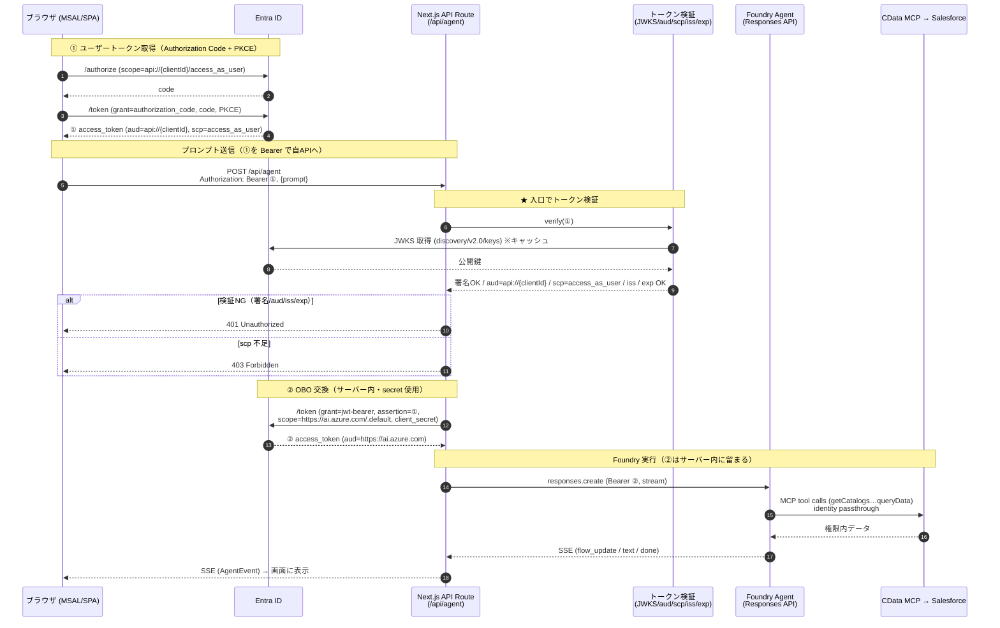

# API Routes トークン検証 シーケンス図（案）

> 目的：`/api/agent`（当アプリのスクラッチ API）で、受け取った①ユーザートークン
> （`aud = api://{clientId}`）を入口で検証してから OBO→Foundry へ進む設計。
> 関連：[architecture.md](./architecture.md) §3・§8 / [setup-real-integration.md](./setup-real-integration.md)

## 設計方針（現状からの変更点）

- 現状：ブラウザが `/api/auth/token` で②Foundry トークンを受け取り、それを `/api/agent` に Bearer で渡す。
  → `/api/agent` の Bearer は②（`aud=ai.azure.com`）で、**自 API が audience ではない**ため自 API として検証できない。
- 変更：**ブラウザは①（`aud=api://{clientId}`）だけを保持**し、`/api/agent` に Bearer① で送る。
  サーバーが**①を検証 →（サーバー内で）OBO→②取得 → Foundry 呼び出し**。**②はブラウザに出さない**。
  `/api/auth/token` は `/api/agent` の内部処理に統合（または撤去）。

## 検証の5項目（Microsoft 公式）

| 検証         | クレーム                                              | 失敗時 |
| ------------ | ----------------------------------------------------- | ------ |
| 署名（JWKS） | `kid` で鍵特定                                        | 401    |
| Audience     | `aud == api://{clientId}`                             | 401    |
| Issuer       | `iss == https://login.microsoftonline.com/{tid}/v2.0` | 401    |
| 有効期間     | `exp` / `nbf`                                         | 401    |
| スコープ     | `scp` に `access_as_user`                             | 403    |

## シーケンス図

## 補足

- 検証は `jose`（`createRemoteJWKSet` + `jwtVerify`）で実装予定。JWKS はキャッシュ。
- ①の入手はブラウザ MSAL（`acquireTokenSilent`）。変更点は「②ではなく①を `/api/agent` に送る」こと。
- **モックモード時は検証をスキップ**（既存の一気通貫デモを壊さない）。

---

# 認証・認可の全体整理（検討メモ）

> 実装検討の過程で整理した「誰が・どこで・何を証明/認可するか」のまとめ。

## 1. 認証(authN) と 認可(authZ) を分ける

- **認証(authN)**＝「誰か」を証明する。
  - ユーザー認証：① ログイン（Authorization Code + PKCE、MFA 等）
  - **ホスト（アプリ）自己証明**：② OBO 時の `client_id` + `client_secret`（＝アプリ本人の暗号的証明）
- **認可(authZ)**＝「何をしてよいか」を決める（下記の積層）。

## 2. ホスト（アプリ）の自己証明はどこで行うか

| 主体                 | プロセス                                   | 証明手段                              |
| -------------------- | ------------------------------------------ | ------------------------------------- |
| ユーザー             | ① ログイン（ブラウザ）                     | 資格情報＋MFA                         |
| **アプリ（ホスト）** | **② OBO 交換（サーバー `/api/agent` 内）** | **`client_id` + `client_secret`**     |
| アプリ → Foundry     | Foundry 呼び出し                           | ②のトークン（Entra 署名が信頼の根拠） |

- **SPA はホスト自己証明力が弱い**：ブラウザに秘密を置けない（パブリッククライアント）ため、`client_secret` を持てない。
  代わりに **登録済み redirect_uri ＋ PKCE ＋ オリジン制限**で補うが、これは「アプリ本人の暗号的証明」ではない。
- **対策＝BFF（Backend For Frontend）**：秘密と強トークンをサーバーに隔離する。本アプリの構成そのもの。
  - SPA が持つのは低機密の ①（`access_as_user`、短命、被害範囲は「そのユーザーが見られる範囲」に限定）。
  - 機密処理（② OBO＝secret、Foundry 呼び出し）はサーバー（機密クライアント）で実施し、**②はブラウザに出さない**。
- さらに強化するなら：サーバーサイド認証（機密クライアント化）／証明書クレデンシャル・マネージド ID（secret レス化）。

## 3. 認可の積層（本ケースは 4〜5 レイヤー）

| #   | レイヤー                      | 何を認可するか                    | 仕組み                                         | 効く場所                    |
| --- | ----------------------------- | --------------------------------- | ---------------------------------------------- | --------------------------- |
| 1   | 自 API の利用                 | ユーザーが当 API を呼べるか       | ①の `scp=access_as_user`（＋`aud`）            | `/api/agent` のトークン検証 |
| 2   | OBO 発行                      | Foundry 用②を発行してよいか       | アプリの委任許可 `user_impersonation` ＋同意   | Entra の OBO 交換           |
| 3   | Foundry 実行                  | そのユーザーが Foundry を使えるか | Azure RBAC `Foundry User`                      | Foundry データプレーン      |
| 4   | CData 接続の利用              | コネクタ経由で下流に行けるか      | per-user OAuth 同意（`oauth_consent_request`） | CData / Logic Apps コネクタ |
| 5   | Salesforce データ（行レベル） | どの商談まで見えるか              | SF のプロファイル/共有ルール                   | Salesforce 本体             |

- 4 と 5 を「下流データアクセス」とまとめれば 4 レイヤー、Salesforce 行レベルを独立で数えれば 5 レイヤー。
- **5 番目がデモの主役**：identity passthrough により、ユーザーが変われば見える商談が変わる（RBAC の可視化）。
- **多層防御**：どれか1つ欠けても機密データに到達しない（②取得でも RBAC 無し→403 / RBAC ありでも CData 未同意→停止 / 通っても SF 権限外の行は返らない）。
- 認可の主体・場所がレイヤーごとに異なる（1・2=Entra スコープ/委任、3=Azure RBAC、4=CData、5=Salesforce）。「API 権限（スコープ）≠ RBAC」がそのまま積層している。

## 4. トークン検証の仕組み（JWKS・公開鍵）

- **検証は別サーバーではなく、当 API Route の中の in-process 処理**（`jose` 等のライブラリ呼び出し）。1リクエストごとに Entra へ問い合わせない（オフライン検証）。
- **秘密鍵は不要**：署名の秘密鍵は Entra（Microsoft）のみが保持。検証側は **Entra の公開鍵（JWKS）だけ**で署名を確認する（非対称鍵 / RS256）。
  - 我々が扱う秘密は `AZURE_CLIENT_SECRET` のみで、これは **② OBO のホスト証明用**（トークン署名鍵とは別物）。
- **JWKS の中身**＝公開鍵の配列。各鍵に `kty`(RSA) / `use`(sig) / **`kid`（鍵ID）** / **`n`,`e`（RSA 公開鍵本体）** / `issuer` / `x5c`,`x5t`。
- **検証の突き合わせ手順**：
  1. トークンヘッダの **`kid`** を読む
  2. JWKS から同じ `kid` の公開鍵を選ぶ
  3. その `n`/`e` で **RS256 署名を検証**（改ざん検知）
  4. 併せて `aud` / `iss` / `exp` / `scp` を確認
- 実機確認済み（本テナント）：トークンの `kid` が JWKS の1鍵と一致 → 公開鍵で **署名検証成功**、署名対象を1バイト改変すると **検証失敗（改ざん検知OK）**。

## 5. 用語

- **OBO = On-Behalf-Of（代理フロー）**：中間層サービスが「サインインしたユーザーの代わりに」下流 API を呼ぶための OAuth 2.0 トークン交換（`grant_type=urn:ietf:params:oauth:grant-type:jwt-bearer` ＋ `requested_token_use=on_behalf_of`）。仕様上は Token Exchange（RFC 8693）系。

## 6. 参考（一次情報）

- OBO フロー：https://learn.microsoft.com/en-us/entra/identity-platform/v2-oauth2-on-behalf-of-flow
- トークン検証（署名/JWKS/iss）：https://learn.microsoft.com/en-us/entra/identity-platform/access-tokens#validate-tokens
- 保護 Web API の検証項目：https://learn.microsoft.com/en-us/entra/identity-platform/scenario-protected-web-api-app-configuration#token-validation
- スコープ/ロール検証：https://learn.microsoft.com/en-us/entra/identity-platform/scenario-protected-web-api-verification-scope-app-roles
- クレーム リファレンス：https://learn.microsoft.com/en-us/entra/identity-platform/access-token-claims-reference
- Foundry 認証・認可（RBAC/スコープ）：https://learn.microsoft.com/en-us/azure/foundry/concepts/authentication-authorization-foundry
